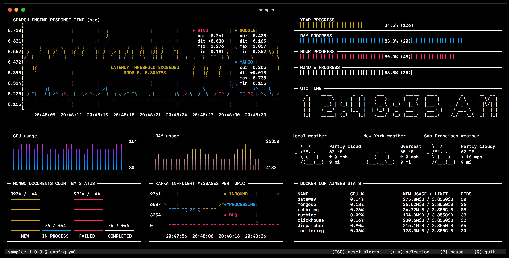

# Welcome to AHO Open Source :material-star-face:

Let us spread the open design philosophy to the people of AHO! Let us

* Show the possibilities of open source
* Teach how to use open source
* Increase our knowledge of open source
* Contribute to open source

Here you will find information and a curated set of tools and assets suitable for studies and work at AHO.

<ul id="lightSlider">

        <li>
          <figure>
            <!--<figcaption>Ardour #music</figcaption>-->
            <figcaption>#music #daw</figcaption>
          </figure>
        </li>
        
        <li>
          <figure>
            
            <!--<figcaption>FreeCAD #cad</figcaption>-->
            <figcaption>#cad #3d</figcaption>
          </figure>
        </li>

        <li>
          <figure>
            
            <!--<figcaption>Blender #cad #rendering</figcaption>-->
            <figcaption>#cad #3d #rendering</figcaption>
          </figure>
        </li>

        <li>
          <figure>
            
            <!--<figcaption>FreeCAD BIM #cad #architecture</figcaption>-->
            <figcaption>#cad #3d #architecture</figcaption>
          </figure>
        </li>

        <li>
          <figure>
            
            <!--<figcaption>Inkscape #graphics</figcaption>-->
            <figcaption>#graphics</figcaption>
          </figure>
        </li>

        <li>
          <figure>
            
            <!--<figcaption>Kdenlive #video</figcaption>-->
            <figcaption>#video</figcaption>
          </figure>
        </li>

        <li>
          <figure>
            
            <!--<figcaption>Krita #graphics</figcaption>-->
            <figcaption>#graphics</figcaption>
          </figure>
        </li>

        <li>
          <figure>
            
            <!--<figcaption>LibreCAD #cad</figcaption>-->
            <figcaption>#cad #2d</figcaption>
          </figure>
        </li>

        <li>
          <figure>
            
            <!--<figcaption>LMMS #music</figcaption>-->
            <figcaption>#music #daw</figcaption>
          </figure>
        </li>

        <li>
          <figure>
            
            <!--<figcaption>Mixxx #music #dj</figcaption>-->
            <figcaption>#music #dj</figcaption>
          </figure>
        </li>

        <li>
          <figure>
            
            <!--<figcaption>Natron #video #vfx</figcaption>-->
            <figcaption>#video #vfx</figcaption>
          </figure>
        </li>

        <li>
          <figure>
            
            <!--<figcaption>Orange #data-analysis</figcaption>-->
            <figcaption>#data-analysis</figcaption>
          </figure>
        </li>

        <li>
          <figure>
            
            <!--<figcaption>Sampler #visualisation</figcaption>-->
            <figcaption>#data-visualization</figcaption>
          </figure>
        </li>

</ul>

## Guides

  - [**Creating your own portfolio using GitHub Pages**](guides/githubpages-portfolio.md)
  - [**Writing an assignment/diploma using Markdown**](guides/markdown.md)

## Program pages

  - [:material-home-city-outline: **Architecture**](programs/architecture.md)
  - [:fontawesome-solid-pen-ruler: **Design**](programs/design.md)
  - [:fontawesome-solid-tree-city: **Landscape Architecture**](programs/landscape_architecture.md)

-----

This site is under construction, see [TODO](todo.md) for more information. Also take a look at {{ resource( "" ) }} for more.
